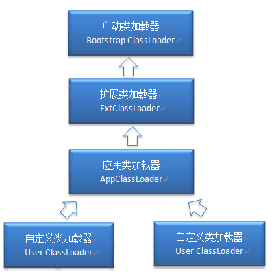

<!-- TOC -->

- [JVM工作原理](#jvm工作原理)
- [类的加载](#类的加载)
- [双亲委托模型](#双亲委托模型)
- [JVM内存分配](#jvm内存分配)

<!-- /TOC -->
# JVM工作原理

JVM 主要由 `ClassLoader` 和 `执行引擎` 两子系统组成.

任何一个Java类的main函数运行都会创建一个JVM实例, 当main函数结束时, JVM实例也就结束了.
JVM实例启动时默认启动几个守护线程, 比如: 垃圾回收的线程, 而 main 方法的执行是在一个单独的非守护线程中执行的.只要母线程结束, 子线程就自动销毁, 只要非守护main 线程结束JVM实例就销毁了.

那么在Java类main函数运行过程中, JVM的工作原理如下:

1. 根据系统环境变量, 创建装载JVM的环境与配置；
2. 寻找JRE目录, 寻找jvm.dll, 并装载jvm.dll；
3. 根据JVM的参数配置, 如: 内存参数, 初始化jvm实例；
4. JVM实例产生一个引导类加载器实例（Bootstrap Loader）, 加载Java核心库, 然后引导类加载器自动加载扩展类加载器（Extended Loader）,加载Java扩展库, 最后扩展类加载器自动加载系统类加载器（AppClass Loader）, 加载当前的Java类；
5. 当前Java类加载至内存后, 会经过验证、准备、解析三步, 将Java类中的类型信息、属性信息、常量池存放在方法区内存中, 方法指令直接保存到栈内存中, 如: main函数；
6. 执行引擎开始执行栈内存中指令, 由于main函数是静态方法, 所以不需要传入实例, 在类加载完毕之后, 直接执行main方法指令；
7. main函数执行主线程结束, 随之守护线程销毁, 最后JVM实例被销毁；

# 类的加载

类加载器结构

只有当一个类要使用的时候，类加载器才会加载这个类并初始化

* 启动类加载器:Java核心库
* 扩展类加载器
* 应用类加载器

# 双亲委托模型

# JVM内存分配

内存结构

类声明周期

