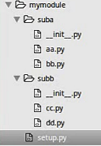
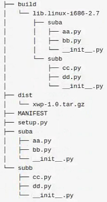
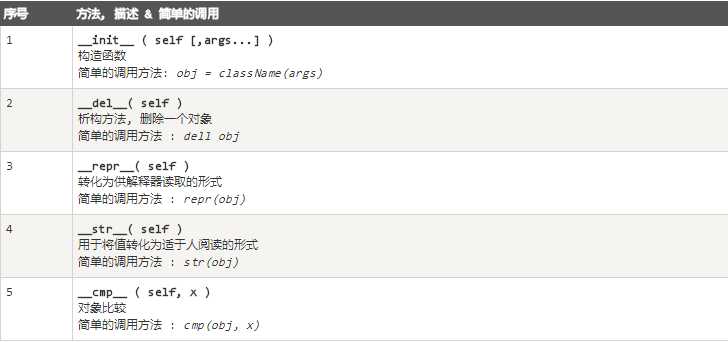

<!-- TOC -->

- [Python&Pythonic](#pythonpythonic)
    - [Python](#python)
    - [Pythonic](#pythonic)
- [开发环境](#开发环境)
    - [IDE](#ide)
    - [第三方库](#第三方库)
- [基本数据类型](#基本数据类型)
    - [字符串](#字符串)
    - [格式化输出](#格式化输出)
- [运算符](#运算符)
- [控制语句](#控制语句)
    - [条件语句](#条件语句)
    - [循环语句](#循环语句)
    - [break](#break)
    - [continute](#continute)
- [注释](#注释)
- [表达式](#表达式)
- [位运算：](#位运算)
- [集合](#集合)
- [list列表](#list列表)
    - [列表的读取](#列表的读取)
    - [Python列表脚本操作符](#python列表脚本操作符)
    - [Python列表函数&方法](#python列表函数方法)
- [Tuple元组](#tuple元组)
    - [访问元组](#访问元组)
    - [元组运算符](#元组运算符)
    - [元组索引&截取](#元组索引截取)
    - [无关闭分割符](#无关闭分割符)
- [Set](#set)
- [字典](#字典)
    - [字典内置函数](#字典内置函数)
- [函数](#函数)
    - [值传递&引用传递](#值传递引用传递)
    - [参数](#参数)
    - [必备参数](#必备参数)
    - [命名参数](#命名参数)
    - [缺省参数](#缺省参数)
    - [不定长参数](#不定长参数)
    - [匿名函数](#匿名函数)
    - [闭包](#闭包)
- [类](#类)
    - [属性](#属性)
    - [内置类属性](#内置类属性)
    - [垃圾回收](#垃圾回收)
    - [继承](#继承)
    - [方法重写](#方法重写)
    - [运算符重载](#运算符重载)
- [模块](#模块)
    - [PYTHONPATH变量](#pythonpath变量)
    - [dir()函数](#dir函数)
    - [globals()&locals()函数](#globalslocals函数)
    - [reload()函数](#reload函数)
    - [Python中包](#python中包)
- [文件](#文件)
    - [File对象的属性](#file对象的属性)
    - [close()方法](#close方法)
    - [read()方法](#read方法)
    - [write()方法](#write方法)
- [文件定位](#文件定位)
- [重命名和删除文件](#重命名和删除文件)
    - [rename()方法](#rename方法)
    - [remove()方法](#remove方法)
- [文件、目录相关的方法](#文件目录相关的方法)
    - [mkdir()方法](#mkdir方法)
    - [chdir()方法](#chdir方法)
    - [getcwd()方法](#getcwd方法)
    - [rmdir()方法](#rmdir方法)
- [异常](#异常)
    - [异常处理](#异常处理)
    - [try....except...else](#tryexceptelse)
    - [try-finally](#try-finally)
    - [自定义异常](#自定义异常)
    - [断言(Assertions)](#断言assertions)
- [总结](#总结)
- [面向对象](#面向对象)
    - [类属性与方法](#类属性与方法)
    - [类的私有属性](#类的私有属性)
    - [类的方法](#类的方法)
    - [类的私有方法](#类的私有方法)
- [CGI编程](#cgi编程)

<!-- /TOC -->

# Python&Pythonic
## Python
* Python, 是一种面向对象、解释型计算机程序设计语言，由Guido van Rossum于1989年发明，第一个公开发行版发行于1991年。
* Python是纯粹的自由软件， 源代码和解释器CPython遵循 GPL(GNU General Public License)协议 。
* Python语法简洁清晰，特色之一是强制用空白符(white space)作为语句缩进。
* Python具有丰富和强大的库。它常被昵称为胶水语言，能够把用其他语言制作的各种模块（尤其是C/C++）很轻松地联结在一起。常见的一种应用情形是，使用Python快速生成程序的原型（有时甚至是程序的最终界面），然后对其中有特别要求的部分，用更合适的语言改写，比如3D游戏中的图形渲染模块，性能要求特别高，就可以用C/C++重写，而后封装为Python可以调用的扩展类库。需要注意的是在您使用扩展类库时可能需要考虑平台问题，某些可能不提供跨平台的实现。
## Pythonic
ythonic指的是按照Python推荐的规范，干净美观、可读性强的代码风格，比如多使用Python内置的数据结构，不要重复造轮子。简单来讲，你可以在Python解释环境里输入import this了解一下Python之禅。Python的代码风格上，如果团队有自己的风格则按照自己的风格，否则，比较推荐的是PEP8或Google Code Style。关于[PEP8规范](https://www.python.org/dev/peps/pep-0008/)
# 开发环境
## IDE
Python常用的IDE（集成开发环境），推荐使用PyCharm.
在Eclipse上安装PyDev插件也可
## 第三方库
安装第三方库的话，推荐使用pip，在Ubuntu上，你可以通过apt-get install python-pip安装。
# 基本数据类型
Python中变量不需要声明,对变量赋值后,会自动为变量分配类型.
Python中的数字有：整型、长整型、浮点型、布尔型、复数。
* 整形：int，常见的整数（正数／负数／0），通过sys.maxint即可查看当前平台上最大的整型的值。
* 长整型：long，比整型最大的值还大或者比整型最小的值还小的整数。注意：Python中长整型没有大小限制，你的内存有多大，它就能表示多大。
* 浮点型：float，即小数。
* 布尔型：bool，常见形式为True, False，表示逻辑真和逻辑假，其实背后的实现是数字1和0.
* 复数：complex，Python是为数不多语法层面上支持复数的语言，表现为形如1+2j的形式。可以直接支持两个复数的运算。
	* 获取复数的是不和虚部分别为:`obj.real`,`obj.imag`,对复数使用`ABS()`,返回复数的模
```python
a = 1
b = true
c = 1.234
d = 3 + 2j
e = 'test python'
```
Python中的所有数据类型都是对象。你可以通过type()函数查看一个变量的类型。
## 字符串
Python中字符串有4种表现形式：单引号、双引号、三引号：

```Python
string1 = 'this is a str'
string2 = "this is a str"
string3 = '''this is a str
这里还是string3的范围'''
string4 = """this is a str"""
```
其中，第3/4种字符串表现形式都是三引号引起来的,字符串中可以包含换行符,制表符,等特殊字符.
可以使用in 或者 not in判断字符串中是否含有某字符
输出特殊形式:
```
print 'hello \'world\''
或同时使用不同引号
print '''hello "world"'''
```

如果在字符串的引号之前加上一个u，则表示这是一个unicode字符串，如果加上r，则表示这是一个原始字符串 值得注意的是，Python中没有C-Like语言中的字符类型。即python不支持单字符类型.单字符也是作为字符串类型.
##格式化输出


# 运算符
Python中没有类似于C/C++/Java的自增自减运算符，因为在Python中，数字是一种不可变类型（immutable），对数字的操作都会产生新的对象而不是修改原来的对象。但是i = i + 1一样可以写为i += 1。
> 注意：Python2.5以后的除法为地板除，即5／2=2而不是5／2 ＝ 2.5。

Python常见的逻辑运算符为：
* !=, <>：不等于，表示两边的值不相等，推荐使用前一种。1 != 2。
* ==：等于，表示两边的值相等。2 == 2。
* and：逻辑与，如果两边的值都为True则整个值为True，反之为* * False。1==1 and 2==2。
* or：逻辑或，如果两边有一个值True则整个值为True，反之为* * False。1==2 or 2==2。
* not：逻辑非，如果值为True，则结果为False。not 2=＝1。
# 控制语句
## 条件语句
Python中的条件语句只有if-elif-else，类似于其他语言中的else if,没有switch-case，但是有经验的开发者通常使用map这一结构来达到比switch-case更加优雅，更加Pythonic的实现。
```
if (a>b):
	print a
elif a == b:
	print a==b
else:
	print b
```
## 循环语句
while循环
```
	while count < 5:
	    print (count,'is less than 5')
	    count = count + 1
	else:
	    print (count,'is not less than 5')
```
for循环:
```
for letter in 'Python':
    print letter
fruits = ['apple','banana','cat','dog']
for i in fruits:
    print i
```
> Python中没有C-Like语言里的for(int i=0; i<10; i++)的语法，不过可以使用xrange或者range函数实现同样的效果。前一个函数返回一个生成器，后一个函数返回list，一般推荐使用前一个.
##break
和C中相似，能够打破最小封闭for或while循环
##continute
和break不同，continue语句跳出本次循环，当前循环中的剩余语句跳过执行，而break跳出整个循环。
# 注释
* 单行注释
	使用#符号
* 多行注释
	'''  '''
	"""  """ 即三个单引号或双引号，中间为注释代码
* 中文处理
	需要在文件开头加上中文注释，不声明则会默认使用ASKII码保存
	#coding=utf-8或#--coding:UTF-8--
# 表达式
幂运算：a**b  a的b次幂
除且向下取整：a//b
| 表达式|说明|类型|
| :-------- | :--------| :------ |
|not a|a的逻辑非|bool|
|a and b|a和b的逻辑与|bool|
|a or b|a和b的逻辑或|bool|
|a is b|a和b是同一个对象|bool|
|a is not b|a和b是不同对象|bool|
> 不等符号：`!=` 和 `<>` ,python后废弃使用`<>`,只保留`!=`
# 位运算：
| 表达式|说明|
| :-------- | :--------|
|a << n|左移n位|
|a >> n|右移n位|
|a & b|位与|
|a \| b|位或|
|a ^ b|位异或|
# 集合
Python中的集合类型有:list,tuple,set,dict

#list列表
list表达的是一列数据的集合，列表中的元素可以增加、删除、查找等操作,可以简单地将列表理解为C中的数组,列表和元组都能够保存任意类型的python对象。
* 列表元素用[]，元组元素使用()括起来。
* 通过截取[] [:]能够得到子集。此操作同于字符串相关操作，基本样式[start：end：length]。

以下即使list的定义:
		
	aList = ['a','b','b']
	aList.append('c') # 增
	aList.remove('c')  #删
	del aList[2]  #删
	aList.reverse()  #反转
	aList.index('b') #查
##列表的读取
    >> str = ['a','b','c','d']
    >> str[2]   # 'c'
    >> str[-2]  # 'c'
    >> str[1:]   # ['b', 'c', 'd']

##Python列表脚本操作符
列表对+和*操作符的支持与字符串类似。+用于拼接列表，*用于重复列表。
| Python表达式 |     结果 |   描述   |
| :-------- | --------:| :------: |
| len([1,2,3])|   3|  length|
|['a']*2|['a','a']|重复列表|
|for x in [1,2,3] print x|1 2 3|迭代|
## Python列表函数&方法
**Python 包含以下函数：**
| No.| 函数|   说明|
| :--------: | :--------| :------: |
| 1|   cmp(list1,list2)|  比较两个列表的元素|
|2|len(list)|列表长度|
|3|max(list)|列表最大值|
|4|min(list)|列表最小值|
|5|list(seq)|将元组转换为列表|
**Python 包含以下方法：**
| No.| 方法|   说明|
| :--------: | :--------| :------ |
|1|list.append(obj)|在末尾添加新的对象|
|2|list.count(obj)|统计某元素出现的次数|
|3|list.extend(seq)|在末尾一次性添加另一个序列的多个值（用新列表扩展原列表）|
|4|list.index(obj)|查找对象的索引值|
|5|list.insert(index,obj)|将对象插入列表|
|6|list.pop(obj=list[-1])|移除列表的一个元素（默认最后一个），并返回该元素的值|
|7|list.remove(obj)|移除某个值的第一个匹配项|
|8|list.reverse()|所有元素反向|
|9|list.sort([func])|排序|
#Tuple元组
元组和列表类似，同样表示一组数据的集合，不同的就是元组的元素不能够新增,修改,也不能删除，也可以进行截取和拼接操作。

    aTuple = ('a','b','c')
##访问元组
	>> aTuple[2]
	'c'
##元组运算符
也可以使用+和*进行运算。
##元组索引&截取
元组本质上也是一个序列，因此可以访问指定位置的元素，也可以截取其中一段元素。
##无关闭分割符
任意无符号的对象，以逗号隔开，默认为元组。

	>> print 'abc', -4.24e93, 18+6.6j, 'xyz'
	abc -4.24e+93 (18+6.6j) xyz
	>> x, y = 1, 2
	>> print "Value of x , y : ", x,y
	Value of x , y :  1 2
#Set
set表示一个不重复元素的集合，值得注意的是：set是无序的。

```python
aSet = {'this', 'is', 'a', 'a', 'set'}  # 初始化
type(aSet) # set
aSet.add('new item')  #增
aSet.remove('a') #删
```

#字典
dict表示一组数据的对应关系,键值对的形式，类似于关联数组或哈希表,key多为数字和字符串,value则可以为任意类型的python对象,与set一样，dict是无序的（你可以通过collections中的OrderDict来达到有序）。使用大括号{}包括,dict与set的声明方式容易混淆：
```python
>> aDict = {'a': 'A', 'b': 'B'}  # 初始化
>> aDict[a] #查
>> 'A'
>> aDict['c'] = 'C' #增
>> del aDict['c'] #删
```
键值使用`:`分隔,键值对使用`,`分隔,key具有唯一性,同一key被多次赋值,则最后一次的被记住,键必须不可变,所以可用数,字符串,或元组充当,因此list不行,value则没有,但必须是不可变的.

del可删除指定键值对,也可以删除整个字典
dict.clear()则可以清空整个字典.
## 字典内置函数
cmp(dict1,dict2) #比较2个字典元素
len(dict) #字典元素的个数,即键的数目

#函数
在Python中声明函数的方式如下：

```
def add(num1, num2):
    return num1 + num2
```

通其它语言一样，你可以在函数中通过return返回值。不同的是，Python中函数可以有多个返回值，比如下面的函数，返回了两个数的和以及差：

```
def calc(n1, n2):
    return n1 + n2, n1 * n2
 
add, sub = calc(5, 1)
print add, sub  # 6 4
```

其实这里并不是真的返回了两个值，而是将返回值组装成一个tuple再返回。
## 值传递&引用传递
引用传递:函数中修改了数据,那么这个原始数据也被改变了.
```
def change(aList):
	"change"
	aList.append([1,2,3,4])
	print aList

aList = ['a','b','c']
change(aList)
print aList
>>> ['a', 'b', 'c', [1, 2, 3, 4]]
>>> ['a', 'b', 'c', [1, 2, 3, 4]]
```
## 参数
调用函数时可以使用的正式参数类型:
* 必备参数
* 命名参数
* 缺省参数
* 不定长参数

## 必备参数
必须以正确的顺序传入函数.调用时的数量必须和声明时的一样
## 命名参数
命名参数和函数调用关系密切,调用方法参数的命名确定传入的参数值,可以跳过不传的参数.因为python能够用参数名匹配参数值

	>>> println(name = 'test',str = 'string')
## 缺省参数
函数调用时,缺省参数的值如果没有传入,则被认为是默认值.默认值通常在函数定义时被赋值.
## 不定长参数
基本语法:
```
def funcation([formal_args,] *avr_args_tuple):
	funcation_suite
	return [expression]
```
`*`号的变量名会存放所有未命名的变量参数,
```
def funcation(arg1, *vartuple):
	print 'result:'
	print arg1
	print '-----'
	print type(vartuple)
	print vartuple

funcation(30,20,40,50)
>>> 
result:
30
-----
<type 'tuple'>
(20, 40, 50)
```
上面的代码中,第二个参数是tuple的形式存在
```
def funcation(arg1, **vartuple):
	print 'result:'
	print arg1
	print '-----'
	print type(vartuple)
	print vartuple

funcation('aa',x=12,y=34)
>>> 
result:
aa
-----
<type 'dict'>
{'y': 34, 'x': 12}
```
这个代码中第二个参数以字典的形式存在.
两种形式的函数的调用方式也有不同
## 匿名函数
lambda关键词能创建小型匿名函数,省略了用def声明函数的标准步骤.
Lambda函数能够接收任何数量的参数,但只能返回一个表达式的值,
匿名函数不能直接调用print,因为lambda需要一个表达式.
lambda函数拥有自己的名称空间,且不能访问自有参数列表之外或全局明辉层空间的参数.
语法:

```
lambda [arg1[,arg2,...argn]]:expression
```
例:
```python
sum = lambda arg1,arg2:arg1 + arg2
print sum(10,20)
type(sum)
>>> function
```
```python
sum=lambda(num1,num2): num1+num2
tuple = (2,3)
sum(tuple)
>>> 5
# 此时函数只有一个参数,是一个元组
```
## 闭包
内部函数对外部函数作用域里变量的引用(非全局变量),则称内部函数为闭包.

# 类
类方法和普通函数的定义相似,但类方法必须以self作为第一个参数.类似于java中this关键字.可以在类外tongue对象名访问
私有:`__private_attrs`在前面加两个下划线,不能再类外直接访问,内部使用`self.__private_attrs`,私有方法类似.
构造方法:`__init__()`,支持重载,用户不定义则使用默认的.
析构方法:`__del__(self)`,在释放对象时调用,支持重载,可以在里面释放资源,不需要显示调用.

在Python类中定义的方法通常有3种:实例方法,类方法&静态方法;
* 实例方法:一般都以self作为第一个参数,必须和具体的对象示例进行绑定才能访问;
* 类方法:以cls作为第一个参数,cls表示类本身,定义时使用`@classmethod`,通过cls应用的必定是类对象的属性和方法.
* 静态方法:不需要什么默认参数,跟一般的普通函数类似,定义时使用`@staticmethod`,静态方法中不需要额外定义参数,因此在静态方法中引用类属性的话,必须通过类对象来引用.

## 属性

```
getattr(obj,name[,default]):访问对象的属性
hasattr(obj,name):检查属性是否存在
setattr(obj,name,value):设置一个属性.如不存在则创建
delattr(obj,name):删除属性
```

## 内置类属性
`__dict__`:类的属性(包含一个字典,由类的数据属性组成)
`__doc__`:类的文档
`__name__`:类名
`__module__`:类定义所在的模块(类的全名是'`__main__.calssName`'),
`__bases__`:类的所有父类构成元素(一个由所有父类组成的元组)
## 垃圾回收
对象创建-->创建引用计数-->对象不再需要-->引用计数=0-->垃圾回收
## 继承

```
class subclass (superclass):
```
1. 父类`__init__()`方法不会自动调用需要在子类的构造中专门调用
2. 调用父类的方法时,需要加上父类类名,且需要带上self参数变量
3. 现在子类中查找方法调用

可以使用`issubclass()`和`isinstance()`方法判断继承关系:
issubslcaa():判断一个类是另一个类的子类或子孙类,issubclass(sub,sup)
isinstance(obj,Class):Class类的对象或其子类的对象,返回true
## 方法重写

```
__init()__(self,[,args...]):构造函数
__del__(self):析构函数,删除一个对象,del obj
__repr_(self):转化为共解释器读取的形式,repr(obj)
__str__(self):转化为适于人阅读的形式,str(obj)
__cmp__(self,x):对象比较,cmp(obj,x)
```

## 运算符重载

#模块
模块中能定义函数,类和变量,也包含可执行代码.通常一个`.py`文件就是一个模块.

使用python代码,使用`import`关键字,导入顺序:当前目录-->pythonpath下的每个目录-->默认路径(linux下/usr/local/lib/python/).模块搜索路径存储在system模块的sys.path变量中,包含上面3个.
```
import module1,mudule2...
from modname import name1,name2...
from modname import *
```
## PYTHONPATH变量
由装在一个列表的许多目录组成
windows:
	

```
set PYTHONPAYH=c:\python35\lib
```

linux:
	

```
set PYTHONPAYH=/usr/local/lib/python
```

## dir()函数
一个有序的字符串列表,存储一个模块里定义过的名字,返回的列表存储了一个模块里定义的所有模块,变量和函数.
```
import math
print(dir(math))
```

## globals()&locals()函数
返回全局和局部空间的名字,类型是字典,可以使用keys()获取.
函数内部调用locals(),返回所有能在该函数里访问的名字.
函数内部调用globals(),返回所有能在该函数里访问的全局名字.

##reload()函数
当一个模块被导入到一个脚本，模块顶层部分的代码只会被执行一次。
因此，如果你想重新执行模块里顶层部分的代码，可以用reload()函数。该函数会重新导入之前导入过的模块。语法如下：

```
reload(module_name)
```

## Python中包
package

```
setup.py
from distutils.core import setup
setup(name="xwp",version="1.0",description="xwp's module",author="renxie",py_modules=['dira.aa','dira.bb','dirb.cc','dirb.dd'])
```

```
python setup.py build # 构建
python setup.py sdist # 打包
```


# 文件

```
file object = open(file_name [, access_mode][, buffering])
```

## File对象的属性


## close()方法
File 对象的 close（）方法刷新缓冲区里任何还没写入的信息，并关闭该文件，这之后便不能再进行写入
## read()方法
read（）方法从一个打开的文件中读取一个字符串

```
fileObject.read([count])
```

被传递的参数是要从已打开文件中读取的字节计数。该方法从文件的开头开始读入，如果没有传入count，它会尝试尽可能多地读取更多的内容，很可能是直到文件的末尾。
## write()方法
write()方法可将任何字符串写入一个打开的文件
write()方法不会在字符串的结尾添加换行符('\n')

```
fileObject.write(string)
```
被传递的参数是要写入到已打开文件的内容
# 文件定位
`tell()`方法告诉你文件内的当前位置；换句话说，下一次的读写会发生在文件开头这么多字节之后。
`seek（offset [,from]）`方法改变当前文件的位置。Offset变量表示要移动的字节数。From变量指定开始移动字节的参考位置。
如果from被设为0，这意味着将文件的开头作为移动字节的参考位置。如果设为1，则使用当前的位置作为参考位置。如果它被设为2，那么该文件的末尾将作为参考位置。
# 重命名和删除文件
## rename()方法
rename()方法需要两个参数，当前的文件名和新文件名。
语法：

```
os.rename(current_file_name, new_file_name)
```

## remove()方法
你可以用remove()方法删除文件，需要提供要删除的文件名作为参数。
语法：

```
os.remove(file_name)
```
# 文件、目录相关的方法
## mkdir()方法
可以使用os模块的mkdir()方法在当前目录下创建新的目录们。你需要提供一个包含了要创建的目录名称的参数。
语法：

```
os.mkdir("newdir")
```

## chdir()方法
可以用chdir()方法来改变当前的目录。chdir()方法需要的一个参数是你想设成当前目录的目录名称。
语法：

```
os.chdir("newdir")
```

## getcwd()方法
getcwd()方法显示当前的工作目录。
语法：

```
os.getcwd()
```

## rmdir()方法
rmdir()方法删除目录，目录名称以参数传递。
在删除这个目录之前，它的所有内容应该先被清除。
语法：

```
os.rmdir('dirname')
```
[File 对象方法](http://www.runoob.com/python/file-methods.html)
[OS 对象方法](http://www.runoob.com/python/os-file-methods.html)

#异常
## 异常处理
## try....except...else
```python
try:
<语句>        #运行别的代码
except <名字>：
<语句>        #如果在try部份引发了'name'异常
except <名字>，<数据>:
<语句>        #如果引发了'name'异常，获得附加的数据
else:
<语句>        #如果没有异常发生
```

except后可以带有变量,变量接收的异常值通常包含在异常的语句中。在元组的表单中变量可以接收一个或者多个值。
元组通常包含错误字符串，错误数字，错误位置。
## try-finally
```
try:
<语句>
finally:
<语句>    #退出try时总会执行
raise
```
## 自定义异常
使用raise语句自己触发异常
```python
raise [Exception [, args [, traceback]]]
```
Exception是异常的类型（例如NameError）参数是一个异常参数值。该参数是可选的，如果不提供，异常的参数是"None"。
最后一个参数是可选的（在实践中很少使用），如果存在，是跟踪异常对象。

创建一个类,直接或间接的继承Exception类或其子类,在程序中就可以触发该异常.

## 断言(Assertions)


#总结

* 可变对象
	* 字典
	* 列表
* 不可变对象
	* 数字
	* 字符串
	* 元组

* 对于不可变对象,当需要一个新的同内容的对象时,Python可能会返回一个已存在的对象.
* 对于可变对象,当需要一个新的同内容的对象时,Python一定会新建一个对象,而不会使用已存在的.

Python只有引用没有赋值
* `赋值`：程序先新建对象target，然后将source的值拷贝到target中。这里，target和source值相同，但是它们是两个完全不同的对象。

* `引用`：程序直接将target指向source，也就是说target和source是同一个对象，target只不过是source的一个别名。

浅拷贝和深拷贝的唯一区别在于对嵌套对象的拷贝处理上
* 浅拷贝(shallow copy):两者关系紧密,即使不是同一对象,内部元素也可能是相同对象,如,切片操作
* 深拷贝(deep copy):关系不紧密,又叫递归拷贝,即将内部元素递归拷贝到目标对象(递归到最底层),两者中不可变对象可能仍是同一对象
> 由于深拷贝要拷贝所有对象，因此有时候会拷贝多余的内容，比如管理用的数据结构应该在不同拷贝间共享
> _deepcopy()_函数提供了两个解决方案避免以上问题：
* 拷贝过程中维护一个备忘字典”memo”，字典中存放已经拷贝过的对象;
* 允许用户在自定义的类中重写拷贝操作或重写要拷贝的组件。

```
copy.copy(x)	Return a shallow copy of x.
copy.deepcopy(x)	Return a deep copy of x.
exception copy.error	Raised for module specific errors.
```


Python虽然具有垃圾回收机制,但当对象引用了外部资源时,垃圾回收机制不一定会回收这些对象,对这些对象的释放需要显示释放,通常使用`_close()_`函数,也可以使用`_try...finally_`释放

函数是对象,因此可以被引用,return,可以作为参数

# 面向对象
构造函数`__init()__`
析构函数 `__del()__` 
```
ClassName.__doc__ 查看类的文档信息
```

## 类属性与方法

## 类的私有属性
`__private_attrs`：两个下划线开头，声明该属性为私有，不能在类地外部被使用或直接访问。在类内部的方法中使用时 `self.__private_attrs`。
Python不允许实例化对象访问私有数据,可以使用`object._className__attrName`访问属性
相关属性:
```
__dict__ : 类的属性（包含一个字典，由类的数据属性组成）
__doc__ :类的文档字符串
__name__: 类名
__module__: 类定义所在的模块（类的全名是'__main__.className'，如果类位于一个导入模块mymod中，那么className.__module__ 等于 mymod）
__bases__ : 类的所有父类构成元素（包含了一个由所有父类组成的元组）
```
属性操作:
```
getattr(obj, name[, default]) : 访问对象的属性。
hasattr(obj,name) : 检查是否存在一个属性。
setattr(obj,name,value) : 设置一个属性。如果属性不存在，会创建一个新属性。
delattr(obj, name) : 删除属性。
```
`issubclass(sub,sup)` - 布尔函数判断一个类是另一个类的子类或者子孙类
`isinstance(obj, Class)` 布尔函数如果obj是Class类的实例对象或者是一个Class子类的实例对象则返回true。

## 类的方法
在类地内部，使用def关键字可以为类定义一个方法，与一般函数定义不同，类方法必须包含参数self,且为第一个参数
## 类的私有方法
`__private_method`：两个下划线开头，声明该方法为私有方法，不能在类地外部调用。在类的内部调用 `self.__private_methods`

以下方法可以重写:



# CGI编程
`CGI(Common Gateway Interface)`,通用网关接口,它是一段程序,运行在服务器上如：HTTP服务器，提供同客户端HTML页面的接口